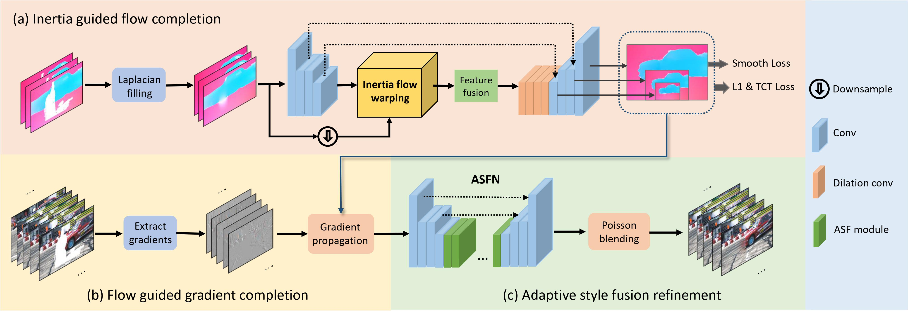

# [CVPR 2022] Inertia-Guided Flow Completion and Style Fusion for Video Inpainting

### [[Paper](https://openaccess.thecvf.com/content/CVPR2022/papers/Zhang_Inertia-Guided_Flow_Completion_and_Style_Fusion_for_Video_Inpainting_CVPR_2022_paper.pdf)] / [[Demo](https://www.youtube.com/watch?v=dHuFDPDWkYc)] / [[Project page](https://hitachinsk.github.io/publication/2022-06-01-Inertia-Guided-Flow-Completion-and-Style-Fusion-for-Video-Inpainting)] / [[Poster](https://drive.google.com/file/d/1FoClSGCu4gZZ3VINMyWnxOxvvR3PTHTL/view?usp=sharing)] / [Intro]

This repository contains the implementation of the following paper:
> **Inertia-Guided Flow Completion and Style Fusion for Video Inpainting**<br>
> [Kaidong Zhang](https://hitachinsk.github.io/), [Jingjing Fu](https://www.microsoft.com/en-us/research/people/jifu/) and [Dong Liu](https://faculty.ustc.edu.cn/dongeliu/)<br>
>  IEEE/CVF Conference on Computer Vision and Pattern Recognition 2022 (**CVPR**), 2022<br>


## Overview
 

Physical objects have inertia, which resists changes in the velocity and motion direction. Inspired by this, we introduce inertia prior that optical flow, which reflects object motion in a local temporal window, keeps unchanged in the adjacent preceding or subsequent frame. We propose a flow completion network to align and aggregate flow features from the consecutive flow sequences based on the inertia prior. The corrupted flows are completed under the supervision of customized losses on reconstruction, flow smoothness, and consistent ternary census transform. The completed flows with high fidelity give rise to significant improvement on the video inpainting quality. Nevertheless, the existing flow-guided cross-frame warping methods fail to consider the lightening and sharpness variation across video frames, which leads to spatial incoherence after warping from other frames. To alleviate such problem, we propose the Adaptive Style Fusion Network (ASFN), which utilizes the style information extracted from the valid regions to guide the gradient refinement in the warped regions. Moreover, we design a data simulation pipeline to reduce the training difficulty of ASFN.  Extensive experiments show the superiority of our method against the state-of-the-art methods quantitatively and qualitatively.

## Prerequisites

- Linux (We tested our codes on Ubuntu18.04)
- Anaconda
- Python 3.7.6
- Pytorch 1.6.0

To get started, first please clone the repo
```
git clone https://github.com/hitachinsk/ISVI.git
```
Then, please run the following commands:
```
conda create -n ISVI
conda activate ISVI
pip install -r requirements.txt
bash install_dependances.sh
```

## Quick start
1. Download the [pre-trained models](https://drive.google.com/file/d/1YCsyGcsaZ5yvMQjMAwLDRWfWXA0fSHel/view?usp=sharing) and the [data](https://drive.google.com/file/d/1aDhC78P0bD9GrKl9mjikyRnRomjeS22h/view?usp=sharing).
2. Put the downloaded zip files to the root directory of this project
3. Run `bash prepare_data.sh` to unzip the files
4. Run the object removal demo
```bash
cd tool
python video_inpainting.py --path xxx \
--path_mask xxx \
--outroot xxx
```
If everythings works, you will find a `result.mp4` file in xxx. And the video should be like:

## License
This work is licensed under MIT license. See the [LICENSE](LICENSE) for details.

## Citation
If our work inspires your research or some part of the codes are useful for your work, please cite our paper:
```bibtex
@InProceedings{Zhang_2022_CVPR,
    author    = {Zhang, Kaidong and Fu, Jingjing and Liu, Dong},
    title     = {Inertia-Guided Flow Completion and Style Fusion for Video Inpainting},
    booktitle = {Proceedings of the IEEE/CVF Conference on Computer Vision and Pattern Recognition (CVPR)},
    month     = {June},
    year      = {2022},
    pages     = {5982-5991}
}
```

Our other video inpainting paper (To appear in ECCV 2022):
```bibtex
@misc{zhang2022flowguided,
      title={Flow-Guided Transformer for Video Inpainting}, 
      author={Kaidong Zhang and Jingjing Fu and Dong Liu},
      year={2022},
      eprint={2208.06768},
      archivePrefix={arXiv},
      primaryClass={cs.CV}
}
```

## Contact
If you have any questions, please contact us via 
- richu@mail.ustc.edu.cn

## Acknowledgement
Some parts of this repo are based on [FGVC](https://github.com/vt-vl-lab/FGVC) and [flow forward warp package](https://github.com/lizhihao6/Forward-Warp).  And we adopt [RAFT](https://github.com/princeton-vl/RAFT) for flow estimation. 


